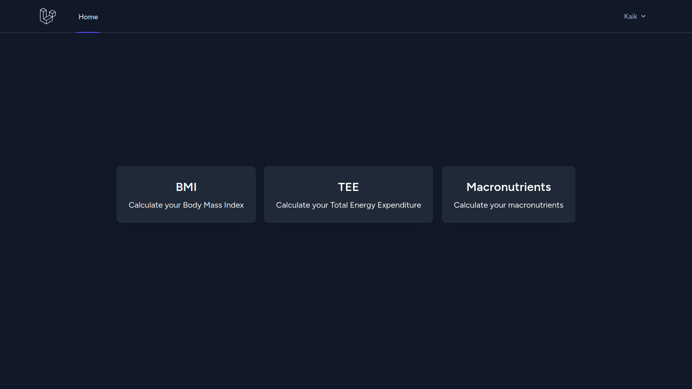
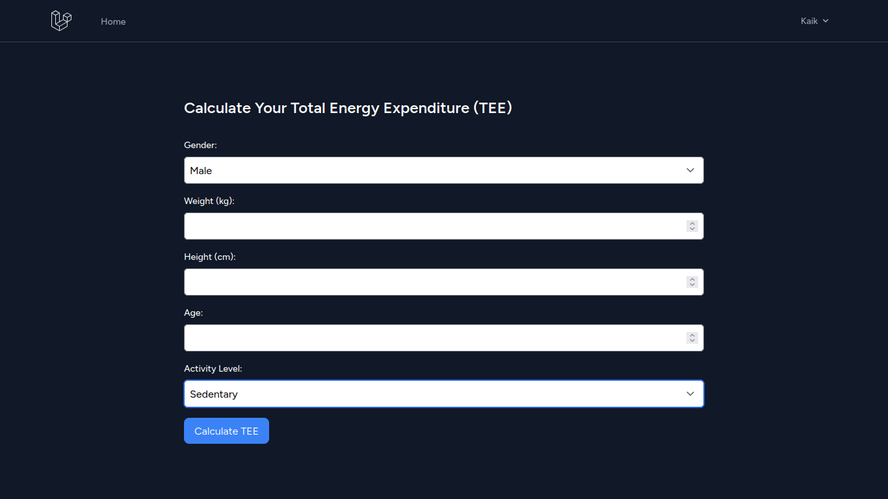
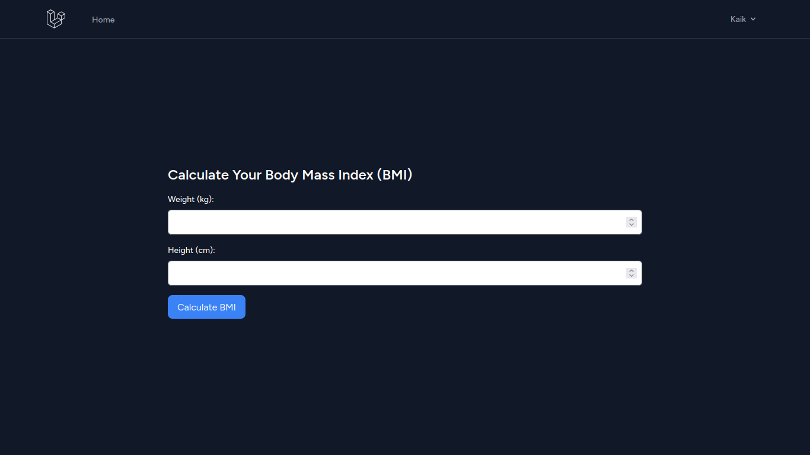
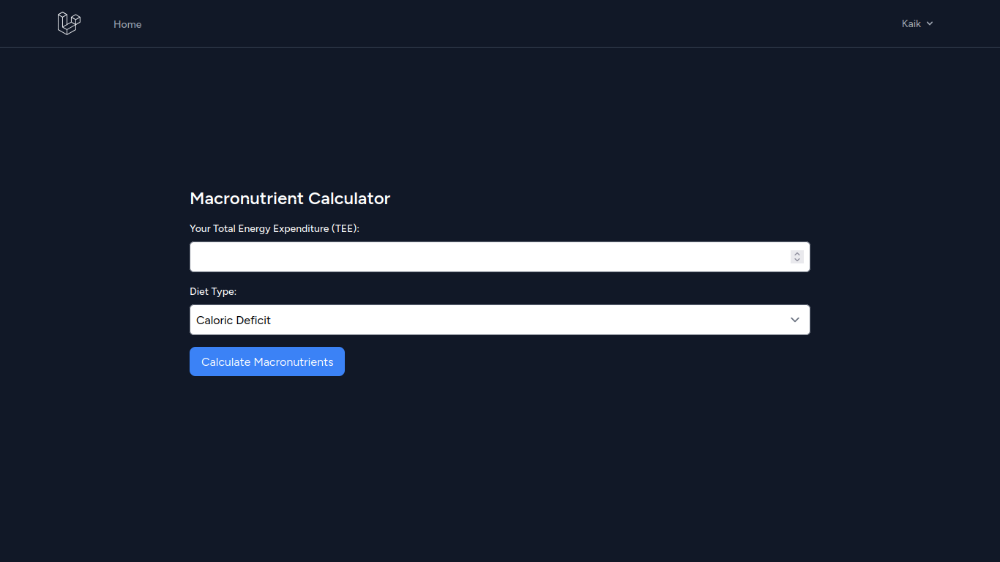

# CalFit

CalFit is a project developed with Laravel 11 and PHP 8.3, focused on helping users calculate their Total Energy Expenditure (TEE), Body Mass Index (BMI), and create personalized diets.

## Features

- Calculation of Total Energy Expenditure (TEE)
- Calculation of Body Mass Index (BMI)
- Creation of personalized diets based on TEE (Available soon)

## Screenshots





## Setup
Step-by-Step Guide

Clone the Repository

```bash
git clone https://github.com/k4ik/CalFit.git
```

Navigate to the Project Directory

```bash
cd CalFit
```

Start the Project Containers

```bash
docker-compose up -d
```

Create the .env File

```bash
cp .env.example .env
```

Access the App Container

```bash
docker-compose exec app bash
```

Install Project Dependencies

```bash
composer install
```

Generate the Laravel Project Key

```bash
php artisan key:generate
```

OPTIONAL: Generate SQLite Database (if not using MySQL)

```bash
touch database/database.sqlite
```

Run Migrations

```bash
php artisan migrate
```

Access the Project Visit http://localhost:8000